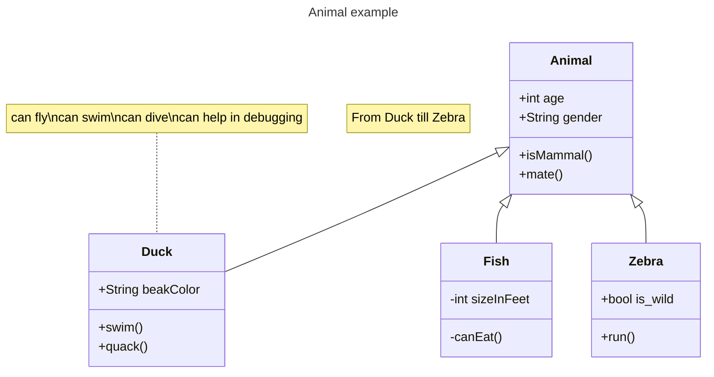
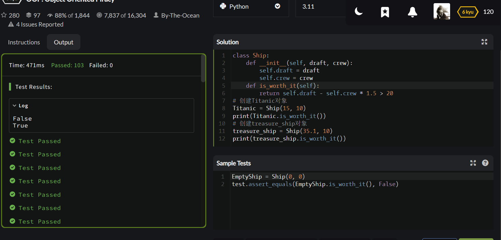
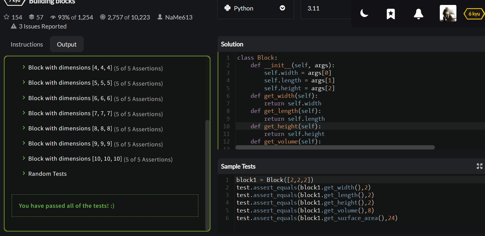
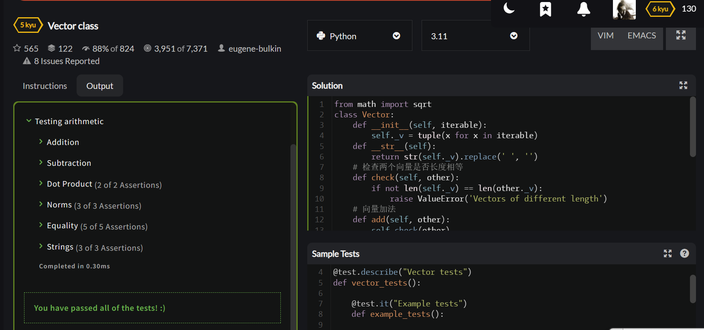
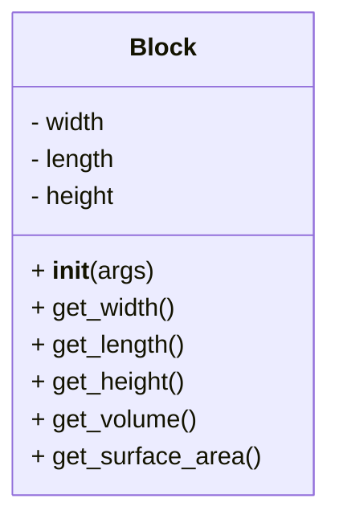

# 实验七 Python面向对象编程

班级： 21计科2

学号： B20210302232

姓名： 闫新宇

Github地址：<https://github.com/yanxinyvvv/syseven.git>

CodeWars地址：<https://www.codewars.com/users/闫新宇>

---

## 实验目的

1. 学习Python类和继承的基础知识
2. 学习namedtuple和DataClass的使用

## 实验环境

1. Git
2. Python 3.10
3. VSCode
4. VSCode插件

## 实验内容和步骤

### 第一部分

Python面向对象编程

完成教材《Python编程从入门到实践》下列章节的练习：

- 第9章 类

---

### 第二部分

在[Codewars网站](https://www.codewars.com)注册账号，完成下列Kata挑战：

---

#### 第一题：面向对象的海盗

难度： 8kyu

啊哈，伙计!

你是一个小海盗团的首领。而且你有一个计划。在OOP的帮助下，你希望建立一个相当有效的系统来识别船上有大量战利品的船只。
对你来说，不幸的是，现在的人很重，那么你怎么知道一艘船上装的是黄金而不是人呢？

你首先要写一个通用的船舶类。

```python
class Ship:
    def __init__(self, draft, crew):
        self.draft = draft
        self.crew = crew
```

每当你的间谍看到一艘新船进入码头，他们将根据观察结果创建一个新的船舶对象。

- `draft`吃水 - 根据船在水中的高度来估计它的重量
- `crew`船员 - 船上船员的数量

`Titanic = Ship(15, 10)`

任务

你可以访问船舶的 "draft(吃水) "和 "crew(船员)"。"draft(吃水) "是船的总重量，"船员 "是船上的人数。
每个船员都会给船的吃水增加1.5个单位。如果除去船员的重量后，吃水仍然超过20，那么这艘船就值得掠夺。任何有这么重的船一定有很多战利品!
添加方法
`is_worth_it`
来决定这艘船是否值得掠夺。

例如：

```python
Titanic.is_worth_it()
False
```

祝你好运，愿你能找到金子!

代码提交地址：
<https://www.codewars.com/kata/54fe05c4762e2e3047000add>

---

#### 第二题： 搭建积木

难度：7kyu

写一个创建Block的类（Duh.）
构造函数应该接受一个数组作为参数，这个数组将包含3个整数，其形式为`[width, length, height]`，Block应该由这些整数创建。

定义这些方法:

- `get_width()` return the width of the `Block`
- `get_length()` return the length of the `Block`
- `get_height()` return the height of the `Block`
- `get_volume()` return the volume of the `Block`
- `get_surface_area()` return the surface area of the `Block`

例子：

```python
b = Block([2,4,6]) # create a `Block` object with a width of `2` a length of `4` and a height of `6`
b.get_width() # return 2    
b.get_length() # return 4
b.get_height() # return 6
b.get_volume() # return 48
b.get_surface_area() # return 88
```

注意： 不需要检查错误的参数。

代码提交地址：
<https://www.codewars.com/kata/55b75fcf67e558d3750000a3>

---

#### 第三题： 分页助手

难度：5kyu

在这个练习中，你将加强对分页的掌握。你将完成PaginationHelper类，这是一个实用类，有助于查询与数组有关的分页信息。
该类被设计成接收一个值的数组和一个整数，表示每页允许多少个项目。集合/数组中包含的值的类型并不相关。

下面是一些关于如何使用这个类的例子：

```python
helper = PaginationHelper(['a','b','c','d','e','f'], 4)
helper.page_count() # should == 2
helper.item_count() # should == 6
helper.page_item_count(0)  # should == 4
helper.page_item_count(1) # last page - should == 2
helper.page_item_count(2) # should == -1 since the page is invalid

# page_index takes an item index and returns the page that it belongs on
helper.page_index(5) # should == 1 (zero based index)
helper.page_index(2) # should == 0
helper.page_index(20) # should == -1
helper.page_index(-10) # should == -1 because negative indexes are invalid
```

代码提交地址：
<https://www.codewars.com/kata/515bb423de843ea99400000a>


---

#### 第四题： 向量（Vector）类

难度： 5kyu

创建一个支持加法、减法、点积和向量长度的向量（Vector）类。

举例来说：

```python
a = Vector([1, 2, 3])
b = Vector([3, 4, 5])
c = Vector([5, 6, 7, 8])

a.add(b)      # should return a new Vector([4, 6, 8])
a.subtract(b) # should return a new Vector([-2, -2, -2])
a.dot(b)      # should return 1*3 + 2*4 + 3*5 = 26
a.norm()      # should return sqrt(1^2 + 2^2 + 3^2) = sqrt(14)
a.add(c)      # raises an exception
```

如果你试图对两个不同长度的向量进行加减或点缀，你必须抛出一个错误。
向量类还应该提供：

- 一个 `__str__` 方法，这样 `str(a) === '(1,2,3)'` 
- 一个equals方法，用来检查两个具有相同成分的向量是否相等。

注意：测试案例将利用用户提供的equals方法。

代码提交地址：
<https://www.codewars.com/kata/526dad7f8c0eb5c4640000a4>

---

#### 第五题： Codewars风格的等级系统

难度： 4kyu

编写一个名为User的类，用于计算用户在类似于Codewars使用的排名系统中的进步量。

业务规则：

- 一个用户从等级-8开始，可以一直进步到8。
- 没有0（零）等级。在-1之后的下一个等级是1。
- 用户将完成活动。这些活动也有等级。
- 每当用户完成一个有等级的活动，用户的等级进度就会根据活动的等级进行更新。
- 完成活动获得的进度是相对于用户当前的等级与活动的等级而言的。
- 用户的等级进度从零开始，每当进度达到100时，用户的等级就会升级到下一个等级。
- 在上一等级时获得的任何剩余进度都将被应用于下一等级的进度（我们不会丢弃任何进度）。例外的情况是，如果没有其他等级的进展（一旦你达到8级，就没有更多的进展了）。
- 一个用户不能超过8级。
- 唯一可接受的等级值范围是-8,-7,-6,-5,-4,-3,-2,-1,1,2,3,4,5,6,7,8。任何其他的值都应该引起错误。

逻辑案例：

- 如果一个排名为-8的用户完成了一个排名为-7的活动，他们将获得10的进度。
- 如果一个排名为-8的用户完成了排名为-6的活动，他们将获得40的进展。
- 如果一个排名为-8的用户完成了排名为-5的活动，他们将获得90的进展。
- 如果一个排名-8的用户完成了排名-4的活动，他们将获得160个进度，从而使该用户升级到排名-7，并获得60个进度以获得下一个排名。
- 如果一个等级为-1的用户完成了一个等级为1的活动，他们将获得10个进度（记住，零等级会被忽略）。

代码案例：

```python
user = User()
user.rank # => -8
user.progress # => 0
user.inc_progress(-7)
user.progress # => 10
user.inc_progress(-5) # will add 90 progress
user.progress # => 0 # progress is now zero
user.rank # => -7 # rank was upgraded to -7
```

代码提交地址：
<https://www.codewars.com/kata/51fda2d95d6efda45e00004e>

---

### 第三部分

使用Mermaid绘制程序的**类图**

安装VSCode插件：

- Markdown Preview Mermaid Support
- Mermaid Markdown Syntax Highlighting

使用Markdown语法绘制你的程序绘制程序类图（至少一个），Markdown代码如下：


显示效果如下：



查看Mermaid类图的语法-->[点击这里](https://mermaid.js.org/syntax/classDiagram.html)

使用Markdown编辑器（例如VScode）编写本次实验的实验报告，包括[实验过程与结果](#实验过程与结果)、[实验考查](#实验考查)和[实验总结](#实验总结)，并将其导出为 **PDF格式** 来提交。

## 实验过程与结果

### 第一部分 Python面向对象编程

**练习9.1：** 
```python
class Restaurant():
    def __init__(self,restaurant_name,cuisine_type):
        self.restaurant_name = restaurant_name
        self.cuisine_type = cuisine_type
    def describe_reataurant(self):
        print("Our reataurant's name is "+ self.restaurant_name.title() +  ' .')
        print("Our restaurant's type is "+ self.cuisine_type.upper() + ' .')
    def open_restaurant(self):
        print("We are opening now!")
restaurant = Restaurant('yxycanguan','chicken')
restaurant.describe_reataurant()
restaurant.open_restaurant()
```

**练习9.2：** 
```python
class Restaurant():
    def __init__(self,restaurant_name,cuisine_type):
        self.restaurant_name = restaurant_name
        self.cuisine_type = cuisine_type
    def describe_reataurant(self):
        print("Our reataurant's name is "+ self.restaurant_name.title() +  ' .')
        print("Our restaurant's type is "+ self.cuisine_type.upper() + ' .')
    def open_restaurant(self):
        print("We are opening now! Welcome~")
restaurant_a = Restaurant('yxycanguan','chicken')
restaurant_a.describe_reataurant()
restaurant_b = Restaurant('liyuancanguan','rice')
restaurant_b.describe_reataurant()
restaurant_c = Restaurant('qingcanguan','noodle')
restaurant_c.describe_reataurant()
```

**练习9.3：** 
```python
class User():
    def __init__(self,first_name,last_name):
        self.first_name=first_name
        self.last_name=last_name
    def describe_user(self):
        print("your name is "+self.first_name+" "+self.last_name)
    def greet_user(self):
        print("hello "+self.first_name+" "+self.last_name)
user1=User("zhang","san")
user2=User("li","si")
user1.describe_user()
user1.greet_user()
user2.describe_user()
user2.greet_user()
```

**练习9.4：** 
```python
class Restaurant():
    def __init__(self,restaurant_name,cuisine_type):
        self.restaurant_name = restaurant_name
        self.cuisine_type = cuisine_type
        self.number_served = 6
    def describe_reataurant(self):
        print("Our reataurant's name is "+ self.restaurant_name.title() +  ' .')
        print("Our restaurant's type is "+ self.cuisine_type.upper() + ' .')
    def open_restaurant(self):
        print("We are opening now!")
    def set_number_served(self,numbers):
        self.number_served = numbers
    def increment_number_served(self,incre):
        self.number_served += incre
    def number_of_diners(self):
        print("Here are "+str(self.number_served)+" guests~")
restaurant = Restaurant('yxycanguan','chicken')
restaurant.describe_reataurant()
restaurant.open_restaurant()
restaurant.set_number_served(50)
restaurant.number_of_diners()
restaurant.increment_number_served(10)
restaurant.number_of_diners()
```

**练习9.5：** 
```python
class User():
    def __init__(self,first_name,last_name,gender,birthday):
        self.first_name = first_name
        self.last_name = last_name
        self.gender = gender
        self.birthday = birthday
        self.login_attempts = 0
    def describe_user(self):
        print("first_name: "+ self.first_name.title())
        print("last_name: "+ self.last_name.title())
        print("gender: "+ self.gender.title())
        print("birthday: "+ self.birthday.title())
    def greet_user(self):
        print("Dear "+self.first_name+" "+self.last_name+" Nice to meet you~")
    def increment_login_attempts(self):
        self.login_attempts += 1
        return self.login_attempts
    def reset__login_attempts(self):
        self.login_attempts = 0
        return self.login_attempts 
user_a = User('zhang','san','nan','1.1')
user_a.describe_user()
user_a.greet_user()
num = user_a.increment_login_attempts()
print(num)
num = user_a.increment_login_attempts()
print(num)
num = user_a.increment_login_attempts()
print(num)
num = user_a.reset__login_attempts()
print(num)
```

**练习9.6：** 
```python
class Restaurant():
    def __init__(self,restaurant_name,cuisine_type):
        self.restaurant_name = restaurant_name
        self.cuisine_type = cuisine_type
    def describe_reataurant(self):
        print("Our reataurant's name is "+ self.restaurant_name.title() +  ' .')
        print("Our restaurant's type is "+ self.cuisine_type.upper() + ' .')
    def open_restaurant(self):
        print("We are opening now!")
class IceCreamStand(Restaurant):
    def __init__(self,restaurant_name,cuisine_type):
        super().__init__(restaurant_name,cuisine_type)
        self.flavors = []
    def describe_flavor(self):
        print("We have the following flavors:")
        for flavor in self.flavors:
            print("-"+flavor)
my_ice_cream = IceCreamStand("Ice Cream Palace","Ice Cream")
my_ice_cream.flavors = ["apple","orange","strawberry"]
my_ice_cream.describe_flavor()
```

**练习9.7：** 
```python
class User():
    def __init__(self,first_name,last_name,gender,birthday):
        self.first_name = first_name
        self.last_name = last_name
        self.gender = gender
        self.birthday = birthday
    def describe_user(self):
        print("first_name: "+ self.first_name.title())
        print("last_name: "+ self.last_name.title())
        print("gender: "+ self.gender.title())
        print("birthday: "+ self.birthday.title())
    def greet_user(self):
        print("Dear "+self.first_name+" "+self.last_name+" Nice to meet you~")
class Admin(User):
    def __init__(self,first_name,last_name,gender,birthday):
        super().__init__(first_name,last_name,gender,birthday)
        self.privileges = []
    def show_privileges(self):
        print("An admin can:")
        for privilege in self.privileges:
            print("-"+privilege)
admin = Admin('Jack','White','m','3.4')
admin.privileges = ['can add post','can delete post','can ban user']
admin.show_privileges()
```

**练习9.8：** 
```python
class Privileges():
    def __init__(self,privileges=["can add post","can delete post","can ban user"]):
        self.privileges=privileges
    def show_privileges(self):
        print("your privileges:")
        for myprivileges in self.privileges:
            print(myprivileges)
class User():
    def __init__(self,first_name,last_name):
        self.first_name=first_name
        self.last_name=last_name
        self.login_attempt=0
    def describe_user(self):
        print("your name is "+self.first_name+" "+self.last_name)
    def greet_user(self):
        print("hello "+self.first_name+" "+self.last_name)
    def increment_login_attempts(self):
        self.login_attempt+=1
    def reset_login_attempts(self):
        self.login_attempt=0
class Admin(User):
    def __init__(self,first_name,last_name):
        super().__init__(first_name,last_name)
        self.privileges=Privileges()
myAdmin=Admin("zhang","san")
myAdmin.privileges.show_privileges()
```

**练习9.9：** 
```python
class Car():
    def __init__(self,make,model,year):
        self.make=make
        self.model=model
        self.year=year
        self.odometer_reading=0
    def get_descriptive_name(self):
        long_name=str(self.year)+" "+str(self.make)+" "+str(self.model)
        return  long_name.title()
    def read_odometer(self):
        print("the car has "+str(self.odometer_reading)+" miles on it")
    def update_odometer(self,mileage):
        if mileage>=self.odometer_reading:
            self.odometer_reading=mileage
        else:
            print("you can't roll back an odometer!")
    def increment_odometer(self,miles):
        self.odometer_reading+=miles
class Battery():
    def __init__(self,battery_size=70):
        self.battery_size=battery_size
    def describe_battery(self):
        print("This car has a "+str(self.battery_size)+" kMh battery")
    def get_range(self):
        if self.battery_size==70:
            range=100
        elif self.battery_size==85:
            range=200
        message = "This car can go approximately "+str(range)
        message += " miles on a full charge"
        print(message)
    def upgrade_battery(self):
        if self.battery_size!=85:
            self.battery_size=85
class ElectricCar(Car):
    def __init__(self,make,model,year):
        super().__init__(make,model,year)
        self.battery=Battery()
my_tesla = ElectricCar("tesla","model s'",2016)
my_tesla.battery.get_range()
my_tesla.battery.upgrade_battery()
my_tesla.battery.get_range()
```

### 第二部分 Codewars Kata挑战

**第1题：面向对象的海盗**
```python
class Ship:  
    def __init__(self, draft, crew):  
        self.draft = draft  
        self.crew = crew  
    def is_worth_it(self):  
        return self.draft - self.crew * 1.5 > 20  
# 创建Titanic对象  
Titanic = Ship(15, 10)  
print(Titanic.is_worth_it())  
# 创建treasure_ship对象  
treasure_ship = Ship(35.1, 10)  
print(treasure_ship.is_worth_it())
```
**运行结果**


**第2题：搭建积木**
```python
class Block:
    def __init__(self, args):
        self.width = args[0]
        self.length = args[1]
        self.height = args[2]
    def get_width(self):
        return self.width
    def get_length(self):
        return self.length
    def get_height(self):
        return self.height
    def get_volume(self):
        return self.width * self.length * self.height
    def get_surface_area(self):
        return 2 * (self.width * self.length + self.width * self.height + self.length * self.height)
```
**运行结果**


**第4题：向量（Vector）类**
```python
from math import sqrt
class Vector:
    def __init__(self, iterable):
        self._v = tuple(x for x in iterable)
    def __str__(self):
        return str(self._v).replace(' ', '')
    # 检查两个向量是否长度相等    
    def check(self, other):
        if not len(self._v) == len(other._v):
            raise ValueError('Vectors of different length')
    # 向量加法
    def add(self, other):
        self.check(other)
        return Vector(s + o for s, o in zip(self._v, other._v))
    # 向量减法
    def subtract(self, other):
        self.check(other)
        return Vector(s - o for s, o in zip(self._v, other._v))
    # 点积运算
    def dot(self, other):
        self.check(other)
        return sum(s * o for s, o in zip(self._v, other._v))
    # 计算向量模
    def norm(self):
        return sqrt(sum(x**2 for x in self._v))
    # 判断两个向量是否相等
    def equals(self, other):
        return self._v == other._v
```
**运行结果**


### 第三部分 使用Mermaid绘制程序流程图

**第4题：向量（Vector）类**
```
classDiagram
    class Block{
        - width
        - length
        - height
        + __init__(args)
        + get_width()
        + get_length()
        + get_height()
        + get_volume()
        + get_surface_area()
    }
```



## 实验考查

1. Python的类中__init__方法起什么作用？
<br/>①用于在创建类的实例时进行初始化操作。当我们通过类创建新的对象时，__init__方法会被自动调用，用来对新创建的实例进行一些必要的初始化操作。②用于为新创建的实例设置初始状态。可以对实例的属性进行赋值，也可以执行其他必要的初始化操作。这样，在创建类的实例时，就可以保证实例在被使用之前具有合适的初始状态。

2. Python语言中如何继承父类和改写（override）父类的方法。
<br/>在Python中，要继承父类并改写（override）父类的方法，可以通过创建子类来实现。子类可以继承父类的属性和方法，并且可以重写父类中的方法以实现自定义的行为。

3. Python类有那些特殊的方法？它们的作用是什么？请举三个例子并编写简单的代码说明。
<br/>①__init__: 初始化方法，在创建对象时进行初始化操作；②__str__: 将对象转换为字符串的方法，在使用 print 函数或 str 函数时调用；③__add__: 用于实现对象相加的方法，在使用加法运算符时调用。
<br/>举例：
```python
class Person:
    def __init__(self, name):
        self.name = name
person = Person("Alice")
print(person.name)
```

```python
class Book:
    def __init__(self, title, author):
        self.title = title
        self.author = author
    def __str__(self):
        return f"{self.title} by {self.author}"
book = Book("Python Crash Course", "Eric Matthes")
print(book)
```

```python
class Point:
    def __init__(self, x, y):
        self.x = x
        self.y = y
    def __add__(self, other):
        return Point(self.x + other.x, self.y + other.y)
point1 = Point(1, 2)
point2 = Point(3, 4)
result = point1 + point2
print((result.x, result.y))
```

## 实验总结

通过本次实验，我学会了在Python的类中，init方法起到在创建类的实例时进行初始化操作以及用于为新创建的实例设置初始状态。我们可以在init方法中对实例的属性进行赋值，也可以执行其他必要的初始化操作。对于继承父类和改写父类方法，我们可以通过创建子类来实现。子类可以继承父类的属性和方法，并且可以重写父类中的方法以实现自定义的行为。以及Python中还有许多特殊的方法init、str和add。实验中遇到的问题也通过询问老师、同学得到解决。